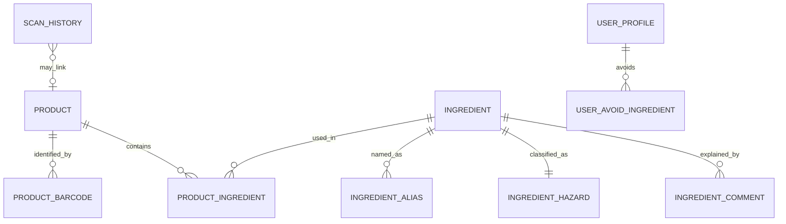

# Data model and bundled schema

SQLDelight is the system of record on the device. The same schema is produced by the catalog build pipeline and opened by the app.

## 1. Domain snapshot



## 2. SQLite schema (v1)

```sql
CREATE TABLE catalog_meta (
    id INTEGER PRIMARY KEY CHECK (id = 1),
    catalog_version TEXT NOT NULL,
    ruleset_version TEXT NOT NULL,
    built_at TEXT NOT NULL,
    region TEXT NOT NULL,
    checksum TEXT NOT NULL,
    supported_comment_locales TEXT NOT NULL  -- BCP-47 list, e.g. 'en,pl'
);

CREATE TABLE product (
    id TEXT PRIMARY KEY,
    name TEXT NOT NULL,
    brand TEXT,
    category TEXT,
    inci_raw TEXT NOT NULL,
    inci_hash TEXT,                -- for later “formula changed” / verify-label
    usage TEXT,                    -- RINSE_OFF | LEAVE_ON | LIP | EYE | SPRAY | UNKNOWN
    source TEXT NOT NULL,          -- 'obf' | 'curated'
    verified INTEGER NOT NULL DEFAULT 0
);

CREATE TABLE product_barcode (
    gtin TEXT PRIMARY KEY,
    product_id TEXT NOT NULL REFERENCES product(id)
);

CREATE TABLE ingredient (
    id TEXT PRIMARY KEY,           -- stable slug, e.g. 'sodium-lauryl-sulfate'
    inci_name TEXT NOT NULL,
    cas_numbers TEXT,              -- comma-separated if several
    ec_numbers TEXT,
    function_tags TEXT             -- 'PRESERVATIVE', 'UV_FILTER', ...
);

CREATE TABLE ingredient_alias (
    alias_normalized TEXT PRIMARY KEY,
    ingredient_id TEXT NOT NULL REFERENCES ingredient(id)
);

CREATE TABLE inci_comma_exception (
    phrase_normalized TEXT PRIMARY KEY,
    ingredient_id TEXT NOT NULL REFERENCES ingredient(id)
);

CREATE TABLE ingredient_hazard (
    ingredient_id TEXT PRIMARY KEY REFERENCES ingredient(id),
    danger_level TEXT NOT NULL,    -- SAFE|LOW|MODERATE|RESTRICTED|HIGH|PROHIBITED
    regulatory_tags TEXT NOT NULL, -- JSON array
    restriction_json TEXT          -- max %, product types, warnings
);

CREATE TABLE ingredient_comment (
    ingredient_id TEXT NOT NULL REFERENCES ingredient(id),
    locale TEXT NOT NULL,          -- BCP-47, e.g. 'en', 'pl'
    summary TEXT NOT NULL,
    detail TEXT,
    PRIMARY KEY (ingredient_id, locale)
);

CREATE TABLE user_profile (
    id INTEGER PRIMARY KEY CHECK (id = 1),
    pregnancy_caution INTEGER NOT NULL DEFAULT 0,
    fragrance_free INTEGER NOT NULL DEFAULT 0,
    locale_preference TEXT NOT NULL DEFAULT 'system',  -- 'system' | 'pinned'
    pinned_locale TEXT                                 -- BCP-47 when pinned
);

CREATE TABLE user_avoid_ingredient (
    ingredient_id TEXT PRIMARY KEY REFERENCES ingredient(id)
);

CREATE TABLE scan_history (
    id INTEGER PRIMARY KEY AUTOINCREMENT,
    scanned_at TEXT NOT NULL,
    gtin TEXT,
    product_id TEXT,
    inci_raw TEXT NOT NULL,
    rating TEXT NOT NULL,
    source TEXT NOT NULL           -- 'barcode' | 'ocr' | 'manual'
);

-- Reserved for post-v1 UI (see further-additions.md); cheap to ship empty.
CREATE TABLE user_shelf (
    product_id TEXT,
    gtin TEXT,
    inci_raw TEXT NOT NULL,
    saved_at TEXT NOT NULL
);

CREATE TABLE report_queue (
    id INTEGER PRIMARY KEY AUTOINCREMENT,
    created_at TEXT NOT NULL,
    kind TEXT NOT NULL,            -- 'missing_product' | 'wrong_inci' | 'wrong_name'
    gtin TEXT,
    payload_json TEXT NOT NULL,
    flushed INTEGER NOT NULL DEFAULT 0
);

CREATE INDEX product_name_idx ON product(name);
CREATE INDEX product_brand_idx ON product(brand);
CREATE INDEX ingredient_inci_idx ON ingredient(inci_name);

CREATE VIRTUAL TABLE product_fts USING fts5(
    name, brand, tokenize = 'unicode61'
);
```

User tables (`user_profile`, `user_avoid_ingredient`, `scan_history`, `user_shelf`, `report_queue`) live in a **separate writable database** (`user.sqlite`) so a catalog replace never wipes history or preferences.

## 3. Evaluation result (in memory, not persisted as source of truth)

```kotlin
enum class DangerLevel {
    SAFE, LOW, MODERATE, RESTRICTED, HIGH, PROHIBITED, UNKNOWN
}

data class IngredientRef(
    val id: String?,
    val displayName: String,
    val matchedBy: MatchMethod
)

enum class MatchMethod { EXACT, ALIAS, FUZZY, UNMATCHED }

data class Finding(
    val ingredient: IngredientRef,
    val level: DangerLevel,
    val regulatoryTags: List<String>,
    val comments: List<LocalizedText>,
    val personalAvoid: Boolean
)

data class LocalizedText(
    val locale: String,
    val summary: String,
    val detail: String?
)

data class ProductAssessment(
    val productName: String?,
    val overall: DangerLevel,
    val suitableForUser: Boolean,
    val findings: List<Finding>,
    val unknownCount: Int,
    val rulesetVersion: String
)
```

`EvaluateFormula` returns `ProductAssessment` with **all** comment locales for each finding (or the repository loads them). The UI picks the row via `CommentLocalizer` for the current `AppLocale`. History stores `rating` + `inci_raw` so a later ruleset can re-evaluate without keeping a frozen copy of every comment. Ratings are enum codes, so a language switch relabels history without a migration.

## 4. Catalog file packaging

1. CI builds `catalog.sqlite`.
2. File is gzip-compressed to `catalog.sqlite.gz` in Compose resources.
3. On first launch (and after a failed checksum): decompress to `files/catalog.sqlite`.
4. App verifies `catalog_meta.checksum` before serving queries.
5. Optional sync downloads `catalog-{version}.delta` and applies in a transaction, then updates `catalog_meta`.

## 5. GTIN rules

- Store digits only, no leading zeros stripped for EAN-13.
- If a scanner returns UPC-A (12 digits), normalize to EAN-13 with a leading `0` before lookup.
- Multiple GTINs may point at one `product` (multipack / market variants) only when the INCI list is the same. If formulas differ, they are different products.

## 6. Comment guidelines

- One sentence in `summary` (what the shopper needs at the shelf).
- Optional `detail` for the ingredient screen (restriction, typical function, why the level was chosen).
- No medical claims. Prefer “listed as a common fragrance allergen in the EU” over “causes allergy”.
- Every `HIGH` / `PROHIBITED` row must have a comment in **every shipped comment locale** (`en`, `pl` in v1) before it ships in the bundled DB. CI fails otherwise.
- Lookup: exact BCP-47 → language → `en` → last-resort any row (UI may show a fallback hint). See [i18n.md](i18n.md).
- UI chrome (buttons, plurals, rating labels) is **not** stored here; it lives in `composeResources`.
