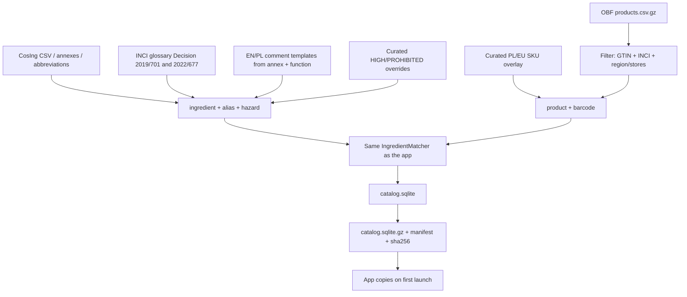
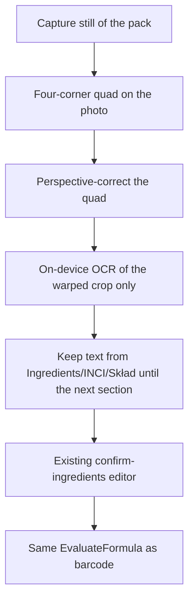

# Plan: catalog scale, INCI OCR crop, Fitatu-inspired UI

This is the **implementation plan** for the next product slice. It does not change behaviour until follow-up PRs land the phases below.

Related docs: [plan.md](plan.md) (v1 architecture), [data-model.md](data-model.md), [further-additions.md](further-additions.md), [catalog/README.md](../catalog/README.md).

---

## 1. Goal

Three tracks, one shopper outcome: **more products resolve from a barcode, more INCI names match, OCR only reads the ingredients block, and the app feels like a modern scan-first consumer tool**.

| Track | Outcome |
| --- | --- |
| **A. Matcher** | Abbreviations (`Alcohol Denat.`) and compound / slash INCI (`Caprylic/Capric Triglyceride`) match as one substance, not as broken tokens. |
| **B. Catalog** | Offline DB holds as many GTINs, printed INCI lists, and CosIng substances as the size budget allows, biased to **EU / Poland** and major chains (Rossmann, Hebe, Douglas / DW, dm, Super-Pharm, Natura). |
| **C. OCR** | User picks the ingredients region with **four corners**. The recognizer extracts only the list that starts at Ingredients / INCI / Skład, then the existing confirm screen. |
| **D. UI** | Scan-first home and colour-coded result header in the spirit of **Fitatu**, without copying food-diary features. |

Keep the existing product rules: offline evaluation, ads never on camera / OCR / Scan / Preferences, CosIng is informational not law, community products stay `source=obf` and unverified.

---

## 2. Current baseline (what already exists)

The app is installable. This slice extends it; it does not restart the architecture.

| Area | Today |
| --- | --- |
| Catalog on device | **8 products**, **~35 ingredients**, seeded from Kotlin fixtures in `CatalogWriter.seedFromFixturesIfNeeded()`. |
| Pipeline | `./scripts/build-catalog.sh` encodes the **same fixture** from `catalog/sources/cosing-ingredients.json` + `obf-products.json`. Engine is ready for a larger dump. |
| Packed DB | Schema and gzip packaging exist; the app does **not** yet boot from a bundled `catalog.sqlite.gz` as the source of truth. |
| Matcher | Exact, alias, parenthetical `Aqua (Water)`, comma exceptions (`1,2-Hexanediol`), fuzzy OCR. `slashMatch` splits on `/` and returns the **first** part that hits — correct for `Aqua/Water`, **wrong** for compound INCI. |
| Abbreviations | Fixture alias for `Alcohol Denat.` / `Alcohol Denatured`. No CosIng abbreviation table. `InciNormalizer` uppercases and collapses spaces; trailing `.` is kept, so `Alcohol Denat` ≠ `Alcohol Denat.`. |
| OCR | Full-frame still → ML Kit (Android) / Vision (iOS). All recognised text is joined with commas. No crop overlay, no bounding boxes on `OcrBlock`, no “start at Ingredients” cut. |
| Confirm | Chip editor + fuzzy accept/reject already exists. Keep it. |
| UI | Default Material 3. Scan tab is a long form (two camera buttons + GTIN field + INCI paste + usage chips). Result is a list with a small rating badge. Bottom nav: Scan, Search, History, More. |

---

## 3. Constraints that shape the plan

### 3.1 Do not scrape retailer sites as the primary catalog

Rossmann, Hebe, Douglas, dm, and similar sites are **not** a bulk source. ToS, blocking, incomplete INCI, and legal risk make scraping the wrong pipeline.

Coverage of those chains comes from:

1. **Open Beauty Facts** nightly dump (ODbL), filtered by country and `stores` tags.
2. **CosIng** + annexes for substances (official EC data).
3. A small **curated overlay** for high-traffic PL SKUs that OBF still misses.
4. On-device **report queue** (`report_queue` already in the schema) for unknown GTINs the user scans.

The OBF API is for **one lookup per user scan**, not for downloading the catalog.

### 3.2 Size vs “every cosmetic on earth”

Original budget: packed DB **under ~30–50 MB** compressed. Ingredients (needed for OCR of unknown barcodes) scale better than products with photos.

Priority when the dump does not fit:

1. All CosIng substances + annex-derived hazards + abbreviation aliases.
2. Products with a valid GTIN **and** a non-empty printed INCI.
3. Prefer `countries_tags` containing Poland, then Germany / EU.
4. Prefer `stores_tags` matching rossmann, hebe, douglas, dm, super-pharm, natura, sephora, notino.
5. If still under budget, add remaining EU cosmetics with GTIN + INCI.
6. Never bundle full-size pack photos in this slice.

### 3.3 Honest data quality

- OBF lists are community data: `source=obf`, `verified=0`.
- CosIng does not make a substance legal to use. Store annex tags; comments stay informational.
- HIGH / PROHIBITED rows still need **en + pl** comments (CI gate). At CosIng scale that means **templated** comments from annex/function, plus editorial overrides for the worst actors — not 30k hand-written essays.

---

## 4. Track A — INCI matcher (do this first)

A large CosIng dump will contain thousands of slash-compound names. If `slashMatch` stays “first part wins”, those products will be scored on the wrong substance.

### 4.1 Slash: synonym vs compound

Tokenizer already splits only on `[,;\n]`. `Caprylic/Capric Triglyceride` is **one token**. The bug is later, in `IngredientMatcher.slashMatch`.

Replace “return the first slash-part that matches” with:

1. Exact / alias on the **full** token (including `/`). After CosIng ingest this hits most official compound INCI names.
2. Parentheticals as today (`Aqua (Water)`).
3. Fuzzy on the **full** token (OCR typo in the compound name) before any slash split.
4. Slash split only as a **synonym form**, and only when **every** part independently resolves to the **same** ingredient id (`Aqua` and `Water` → `aqua`; `Parfum` and `Fragrance` → `parfum`).
5. If parts resolve to different ingredients, or only the first part hits, **do not** accept that match. Leave unmatched (or a later longest-phrase pass).

Protected-phrase table (optional but useful for dump quality): ingest CosIng / glossary names that contain `/` into `inci_comma_exception`-style protection **or** a dedicated `inci_slash_compound` table so a future tokenizer never splits them. Matching must not depend on this table if the full `inci_name` is already in `ingredient`.

Table-driven tests to add (minimum):

| Input | Expected |
| --- | --- |
| `Aqua/Water` | `aqua` (synonym slash) |
| `Parfum/Fragrance` | `parfum` |
| `Caprylic/Capric Triglyceride` | that CosIng ingredient, **not** `Caprylic` |
| `Styrene/Acrylates Copolymer` | that polymer, not `Styrene` |
| `PEG-40 Hydrogenated Castor Oil` | one token |
| `Aqua (Water)` | `aqua` |
| `Alcohol Denat.` / `Alcohol Denat` / `Alcohol Denatured` | `alcohol-denat` |
| `Niacinamide (nano)` / `Titanium Dioxide (nano)` | base ingredient; nano noted, not a separate unknown |
| `1,2-Hexanediol` | still one token |
| OCR typo of a slash compound | fuzzy on full token, not first-part alias |

### 4.2 Abbreviations and punctuation

`InciNormalizer` should treat labelling noise as equivalent:

- Collapse whitespace, Unicode NFKC, uppercase (already).
- Strip trailing `.` and excess punctuation (`Alcohol Denat.` = `Alcohol Denat`).
- Keep internal hyphens and digits (`PEG-40`, `CI 77891`).
- Map CosIng **standard INCI abbreviations** (CosIng → Reference data → Abbreviations; also Decision (EU) 2019/701 / 2022/677 glossary) into `ingredient_alias`.

Examples the dump must cover: `Denat.`, `PEG`, `PPG`, `CI`, `EDTA` forms, `BHT`, `BHA`. `Alcohol Denat.` is a real INCI name, not only an abbreviation of ethanol — keep it as its own row with aliases.

### 4.3 Nano and other label suffixes

Strip a trailing `(nano)` / `[nano]` for matching; keep a flag or suffix on the review chip so the user sees it. Do not invent a separate hazard unless annex data says so.

### 4.4 Where the code lives

- Domain: `IngredientMatcher`, `InciNormalizer`, `InciTokenizer`.
- No Compose, no SQLDelight types in the matcher.
- Tests in `IngredientMatcherTest` (table-driven). Keep methods small; extract `SlashSynonymMatcher` if `matchWithoutFuzzy` grows.

**Do not ship the large catalog until this matcher and tests are green.** Otherwise barcode hits will look complete and be wrong.

---

## 5. Track B — catalog: GTINs, substances, products

### 5.1 Pipeline shape (CI, not the phone)

Keep `CatalogBuilder` as the validation + fingerprint step. Add **ingest jobs** in `catalog/` (Python or JVM) that write the existing JSON (or a streaming format if JSON is too large). Do not grow `FixtureIngredients.kt` to tens of thousands of lines.

### 5.2 Substances (CosIng)

Ingest, at minimum:

- Inventory / glossary INCI names, CAS/EC when present.
- Aliases: CosIng synonyms + abbreviation list + common label forms (`Water`, `Fragrance`, `Aroma`).
- Annex II–VI: `PROHIBITED` / `RESTRICTED` + `regulatory_tags` + `restriction_json` (max %, rinse-off, children, etc.).
- `inci_comma_exception` for names that contain a comma (`1,2-Hexanediol` and the rest of that CosIng set).
- Function tags when CosIng provides them.

Comment strategy:

| Level | Comment source |
| --- | --- |
| PROHIBITED / HIGH | Templated annex sentence in **en and pl**, plus a curated override file for well-known actives (MIT, formaldehyde releasers, etc.). CI still fails if either locale is missing. |
| RESTRICTED | Template: “Allowed under EU conditions (Annex …). Check leave-on vs rinse-off.” |
| MODERATE / LOW / SAFE | Short function-based templates. Unknown function → generic “Listed in the CosIng inventory; not flagged in this ruleset.” |

Do **not** generate medical claims (“causes cancer”). Prefer “listed in Annex II”.

### 5.3 Products (Open Beauty Facts + overlay)

Source dump: `https://static.openbeautyfacts.org/data/en.openbeautyfacts.org.products.csv.gz` (UTF-8, tab-separated). Field notes: [OBF data](https://world.openbeautyfacts.org/data), [data-fields](https://world.openbeautyfacts.org/data/data-fields.txt). ODbL: keep attribution in Settings / legal copy.

Keep a row only if:

- `code` is a plausible GTIN (8 / 12 / 13 / 14 digits; store digits only; UPC-A → EAN-13 with leading `0`).
- Printed INCI is non-empty (`ingredients_text` or language-specific `ingredients_text_pl` / `_en` / `_de`; prefer the longest Latin INCI-looking string).
- Product looks like a cosmetic (categories / `ingredients_text` heuristic; drop empty or food-like junk).

Ranking / inclusion:

1. `countries_tags` contains `en:poland` (or `pl`).
2. Else Germany, France, EU tags.
3. Boost if `stores` / `stores_tags` match: rossmann, hebe, douglas, dm, “super-pharm”, natura, sephora, notino, rossmann-polska.
4. Drop rows with no brand and no name.

Map into existing `ObfProductRecord`: `id`, `name`, `brand`, `category`, `inciRaw`, `usage` (infer rinse-off from category when possible: shampoo, shower gel, soap → `RINSE_OFF`; cream, serum, deodorant leave-on → `LEAVE_ON`; else `UNKNOWN`), `source=obf`, `verified=false`, `gtins`.

Same INCI + same brand name with multiple GTINs → one `product` and several `product_barcode` rows. Different INCI → different products.

### 5.4 Curated overlay (Poland / chains)

A small JSON (hundreds, not millions) for SKUs that shoppers will scan first and OBF still misses. Hand-checked INCI from the pack (not from a scraped HTML blob). `source=curated`, `verified=1`.

This is how “Rossmann / Hebe / Douglas coverage” improves without scraping those shops. Expand the overlay over time from the in-app report queue.

### 5.5 Switch the app off fixture seed

Today first launch writes `FixtureCatalog`. After a real pack exists:

1. CI writes `catalog/build/catalog.sqlite.gz` and `catalog-manifest.json`.
2. Copy gzip + manifest into `composeResources/files/` (git-lfs or CI artifact if the file is large; do not commit a 50 MB blob if the host forbids it — document the artifact path).
3. `CatalogBootstrap` decompresses, verifies SHA-256, opens SQLDelight.
4. Fixtures remain **unit-test** data only (`FixtureCatalog` for matcher / evaluation tests).
5. Unknown GTIN: existing not-found → OCR path; also enqueue `report_queue.kind = missing_product` when the user evaluates a list (no network required).

Quality gates in CI (fail the catalog job, not the phone):

- HIGH / PROHIBITED have en+pl comments.
- Every product has ≥ 1 GTIN and non-empty `inci_raw`.
- Matcher can tokenize the dump without throwing.
- Packed gzip size printed; fail if over the agreed cap (start at **50 MB**).
- Sample GTINs: keep the 8 fixture barcodes in tests; add a handful of real OBF PL GTINs as snapshot tests (INCI hash, not full dump in git).

### 5.6 What “as many as possible” means in practice

| Layer | Target |
| --- | --- |
| Substances | Full CosIng inventory used for matching (tens of thousands of names + aliases), not the 35 fixture rows. |
| Products | All OBF cosmetics that pass GTIN+INCI+EU/PL filters, up to the size cap; curated overlay on top. |
| Chains | Coverage is **probabilistic** via OBF store/country tags + overlay, not a guaranteed Rossmann catalogue clone. |

If the first filtered dump is small, widen country tags before scraping anything.

---

## 6. Track C — OCR: ingredients-only + four-corner crop

### 6.1 Desired flow

Ads stay off this entire path. Confirm stays mandatory (OCR will still misread curved bottles).

### 6.2 Four-corner selection

After still capture, open a dedicated crop screen (not a live-camera overlay — stills are more accurate and easier to drag).

- Show the photo full-screen, dimmed outside the quad.
- Four draggable corner handles; edges drawn between them.
- Default quad: inset ~8–12% from each edge, or a detected “Ingredients” block if bounding boxes exist.
- Actions: **Use this area**, **Reset**, **Retake**.
- Store the quad as four normalized points `(x, y)` in 0..1 so rotation/resize does not depend on raw pixels.
- Accessibility: large handles, content descriptions, not colour-only.

Perspective warp:

- **Android:** `Matrix.setPolyToPoly` (quad → rectangle) then `Bitmap.createBitmap`; OCR the result.
- **iOS:** `CIPerspectiveCorrection` (or equivalent) then Vision on the CIImage.
- Shared contract, e.g. `PerspectiveCropper.crop(frame, quad): CameraFrame`. Domain stays bitmap-free.

`OcrBlock` gains optional normalized bounds so later we can auto-suggest the quad. Confidence can stay 1f until a recognizer actually reports it.

### 6.3 Extract only the ingredients block

New pure-Kotlin `IngredientBlockExtractor` (scanning domain). Unit-test with real label transcripts (EN/PL/DE/FR). No ML Kit types in commonMain.

**Start markers** (line start or `:` / `-` after the word, case-insensitive, OCR-tolerant):

- EN: `ingredients`, `ingredient list`, `inci`, `composition`
- PL: `skład`, `składniki`, `skład inci`
- DE: `inhaltsstoffe`, `zutaten`
- FR: `ingrédients`, `composition`
- ES/IT: `ingredientes`, `ingredienti`

**Stop markers** (next labelled section — do not ingest these as INCI):

- EN: `directions`, `how to use`, `warnings`, `caution`, `made in`, `manufacturer`, `distributed by`, `best before`, `pao`
- PL: `sposób użycia`, `ostrzeżenia`, `wyprodukowano`, `dystrybutor`, `pojemność`, `termin`, `partia`
- DE: `anwendung`, `warnung`, `hergestellt`

Rules:

1. Prefer the **last** start marker (many packs repeat branding above the list).
2. If the user already cropped tightly and **no** start marker is found, use the **entire crop**. The crop is the user’s statement of where the list is.
3. Drop lines that are only digits, weights (`50 ml`), or a GTIN.
4. Join remaining lines with commas (or keep existing tokenizer input). Do **not** join the whole pack with commas the way `MlKitIngredientListRecognizer` does today (`text.text.replace('\n', ',')` on the full frame).
5. Empty after extract → existing `ocr.empty` failure: flatten, torch, retake, or paste.

Android/iOS recognizers should pass **line-preserving** text into the extractor (newlines between blocks), not a pre-joined INCI string.

### 6.4 Files / types (keep under 500 lines)

| Piece | Role |
| --- | --- |
| `IngredientBlockExtractor` | Header/stop cut; tested in commonTest |
| `PerspectiveCropper` expect/actual | Warp |
| `OcrQuad` / `OcrBlock` bounds | Geometry |
| `CropIngredientsScreen` + ViewModel | Four handles; no ads |
| `PrepareIngredientReview` | Unchanged input: a cleaned INCI string |
| `MlKitIngredientListRecognizer` / Vision | OCR the **cropped** bitmap; keep line breaks |

Camera capture path today: `CameraScanViewModel` → `recognize(frame)` → `prepareReview`. Insert crop **between** still and `recognize`.

---

## 7. Track D — UI / UX (Fitatu as a reference, not a clone)

Fitatu (Polish consumer health scanner) is the **interaction** example: scan-first home, strong colour on the product score, large tap targets, recent items, progressive disclosure. Do **not** add a food diary, calories, or social graph.

### 7.1 What to copy in spirit

| Fitatu pattern | This app |
| --- | --- |
| Home is a dashboard, not a form | Scan tab: recent scans + one primary **Scan barcode** control + secondary **Scan skład** / search |
| Product card headed by a score colour | Result: full-width header in `RatingColors` (safe green → prohibited red), word + shape + colour (already in `RatingBadge`) |
| Fast scan → result | Barcode still debounce 800 ms; unknown GTIN offers INCI photo immediately, paste is secondary |
| Dense history / search rows | Brand, name, rating mark, date; not a bare `ListItem` |
| Clean light surface | Custom light scheme; **do not** let Material You recolour rating semantics |
| Bottom navigation | Keep Scan / Search / History / More; Scan is the home dashboard |

### 7.2 Scan tab (home)

Replace the current stacked form with:

1. **Hero:** large barcode scan button (full width or circular FAB-style, still a sibling in the column — no overlay on camera).
2. **Secondary row:** Scan ingredients · Type / paste INCI (paste behind an expand / “more ways”).
3. **Recent:** last 3–8 history cards with colour strip by rating; tap reopens result.
4. Usage chips only when needed (OCR path / unknown usage), not the first thing on home.
5. Manual GTIN field behind “Enter barcode” so the happy path is camera.

Unknown barcode: short card on this tab (`scan_not_found_*`) with one primary CTA to the four-corner INCI flow.

### 7.3 Result

- Colour-coded header: product name, brand, large rating, usage line, unknown-count if any.
- Banner **below** the header / in the reserved bottom slot — never over the header or ingredient rows.
- Ingredient rows: left severity strip, INCI name, one-line comment, unmatched styling.
- Disclaimer stays at the end, persistent, not a blocking dialog every time.

### 7.4 Search and history

- Search field at top; results show brand + name + optional category.
- History: date, source (barcode / OCR / manual), rating mark.
- Empty states with a single scan CTA.

### 7.5 Theme and chrome

- `CosmeticsTheme`: light-first, white / off-white surfaces, one accent; dark mode can follow system later without changing rating colours.
- Bottom bar icons: Scan should look like a scanner, not a generic Add.
- Keep EN/PL string keys in `composeResources`; no literals in Kotlin.
- minSdk 26 / iOS 15.3 unchanged.

### 7.6 Ads (unchanged policy)

Allowed: Search, History, Result (reserved slot). Forbidden: Scan home hero, camera, crop, confirm, Preferences. Collapse on no fill / deny / offline.

---

## 8. Implementation order

Each phase leaves the app **installable**. Catalog build stays in CI.

| Phase | Track | What lands | App still works if |
| --- | --- | --- | --- |
| **A1** | Matcher | Slash synonym vs compound, punctuation/abbreviation normalize, nano strip, table tests | Fixture catalog only |
| **B1** | Catalog | CosIng ingest → ingredients JSON/SQLite; comment templates; abbreviation aliases | Products still fixtures |
| **B2** | Catalog | OBF filter + curated overlay; pack gzip; boot from bundled DB; fixtures for tests only | OCR still full-frame |
| **C1** | OCR | Four-corner crop + perspective + OCR on crop | Extractor can be identity |
| **C2** | OCR | `IngredientBlockExtractor` + line-preserving OCR; confirm unchanged | — |
| **D1** | UI | Theme + Scan home dashboard + result header | — |
| **D2** | UI | Search/history density, recent cards, scan CTA polish | — |

Recommended merge order: **A1 → C1/C2 can parallel B1 → B2 → D1 → D2**. Do not merge B2 before A1.

Optional later (already in further-additions, not this slice): multi-shot OCR, verify pack vs catalog, shelf/compare, live HTTP catalog host.

---

## 9. Testing

| Layer | Cases |
| --- | --- |
| Matcher | Table in §4.1; abbreviation with/without `.`; slash synonym vs compound; nano |
| Extractor | PL `Skład:` … `Sposób użycia`; EN `Ingredients:` … `Directions`; no header + tight crop = full text; header in the middle of noise |
| Catalog CI | Size cap, comment locales, GTIN normalize, duplicate GTIN → one product when INCI matches |
| Crop | Unit-test quad math on JVM if warp is extracted; instrumented: handles remain tappable |
| UI | Screenshot / pseudo-locale for home + colour header (SAFE / AVOID / unknown mix); TalkBack on rating header |
| Ads | Policy tests still forbid camera, crop, confirm, Scan |
| Quality | `./scripts/check-quality.sh` before every commit; files ≤ 500 lines; no `catch (Throwable)` |

Do not call live OBF or CosIng from unit tests. Commit a **tiny** filtered fixture dump plus golden hashes.

---

## 10. Risks

| Risk | Mitigation |
| --- | --- |
| OBF thin for Rossmann private label | OCR + curated overlay + missing-product queue |
| Slash matcher ships after the dump | Phase A1 is a gate for B2 |
| Gzip over 50 MB | Drop non-EU products first, then products without store tags, never drop CosIng names |
| Templated comments feel generic | Editorial overrides for HIGH/PROHIBITED; disclaimer |
| Four-corner UX fiddly on small phones | Large handles, default inset, retake; optional later “detect Ingredients box” |
| Perspective warp quality | Still + torch already there; confirm editor remains |
| Retailer scrape temptation | Out of scope; document in this file |
| Material You recolors traffic lights | `RatingColors` stay fixed |

---

## 11. Out of scope for this slice

- Scraping Rossmann / Hebe / Douglas / dm HTML or unofficial APIs.
- Cloud OCR, accounts, live prices, “buy this”.
- Interstitials, ads on scan/camera/crop.
- Treating CosIng as a live legal oracle.
- Global pack photography in the DB.
- Food-diary / calorie UX from Fitatu.

---

## 12. Success criteria

1. A shopper in a Polish drugstore can scan a **real** GTIN that exists in the filtered OBF/curated set and see a rating offline.
2. An unknown GTIN can be evaluated by photographing the skład: four corners around the list, parser starts at Ingredients/Skład, confirm, same engine.
3. `Caprylic/Capric Triglyceride` and `Alcohol Denat.` (with or without the dot) match as single substances.
4. Substance count is CosIng-scale, not ~35 fixture rows; product count is “all that fit” under the size cap, EU/PL first.
5. Home looks scan-first; result header colour matches the rating; ads still never cover scan or OCR.
6. Android and iOS share matcher, extractor, and catalog file.

---

## 13. Suggested follow-up PRs (after this plan)

Use separate branches, one phase each, all `cursor/<name>-4039`:

1. `cursor/inci-slash-abbrev-4039` — Track A
2. `cursor/cosing-ingest-4039` — Track B1
3. `cursor/obf-regional-catalog-4039` — Track B2
4. `cursor/ocr-quad-crop-4039` — Track C1
5. `cursor/ocr-ingredients-block-4039` — Track C2
6. `cursor/fitatu-scan-ui-4039` — Track D
