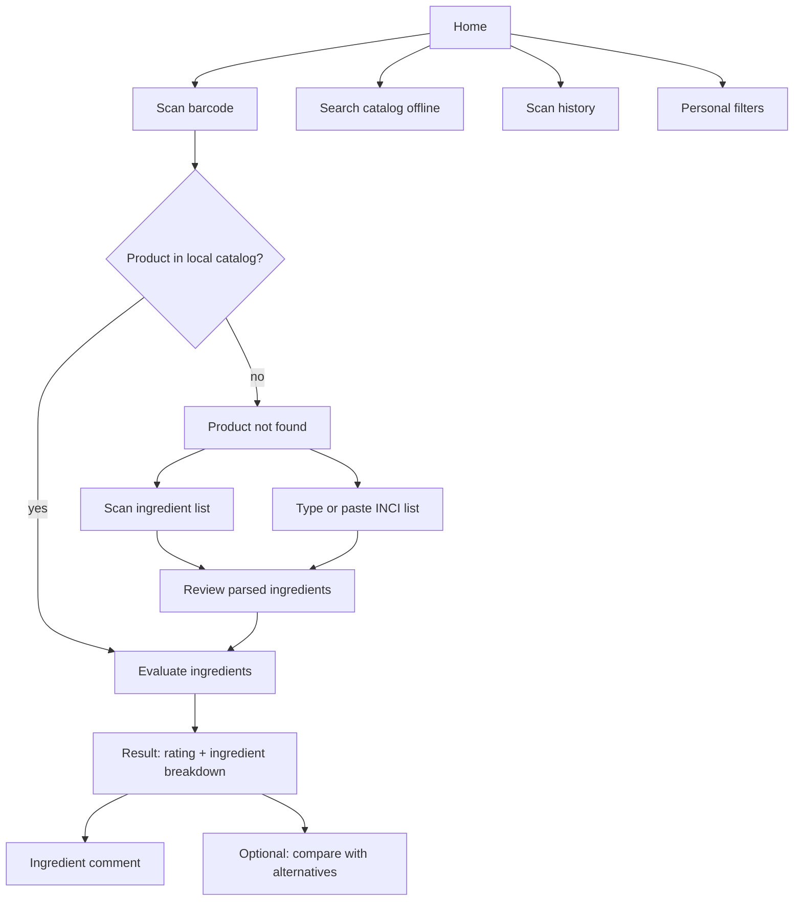
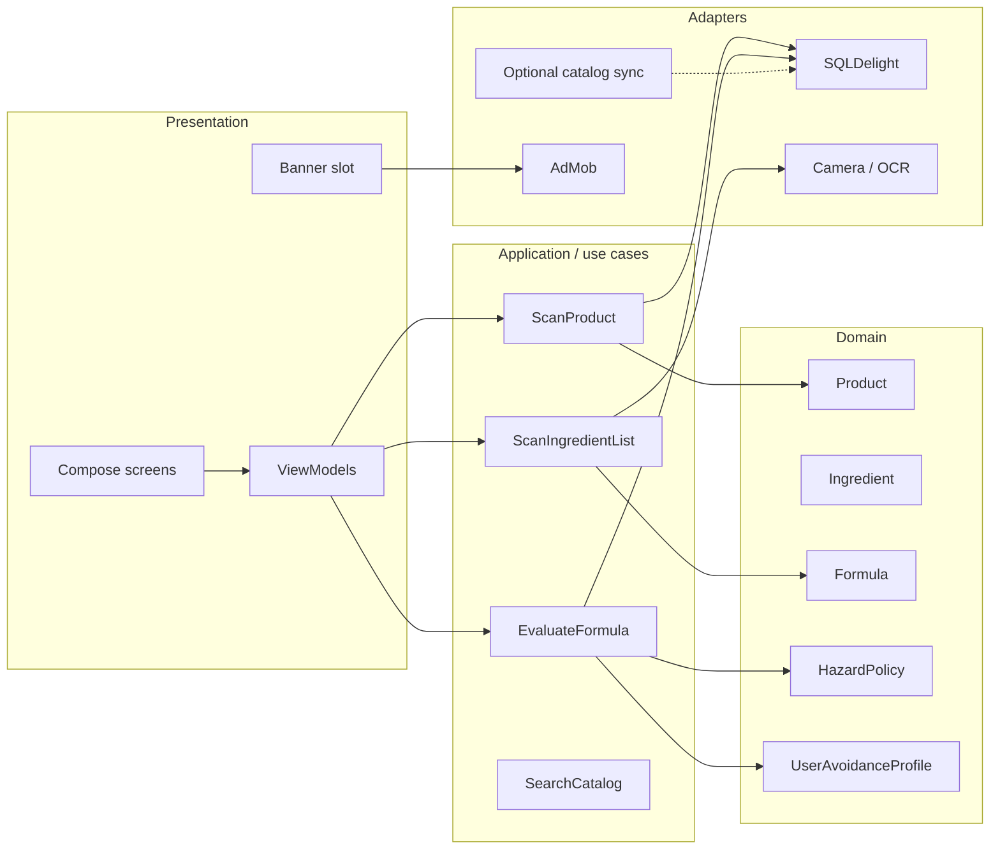

# Cosmetic Ingredient Scanner — Product and Architecture Plan

## 1. Goal

Build a **Kotlin Multiplatform** mobile app for **Android and iOS** that helps a shopper decide whether a cosmetic product is suitable for them.

The app must:

1. Scan a **barcode** and resolve the product from a local catalog.
2. Evaluate the product’s **ingredients** against a local knowledge base of hazard levels and comments.
3. Work **without an internet connection** for lookup, evaluation, and browsing.
4. Fall back to **scanning the printed ingredient list** (INCI composition / skład) when the barcode is unknown.
5. Show **ad banners** that never block scanning, results, or other primary interactions.
6. Be **easy to translate**: UI copy and editorial comments are externalized, with a locale fallback chain and an in-app language setting.

This is an **informational consumer tool**, not a medical or regulatory authority. Every result screen must carry a short, persistent disclaimer.

---

## 2. Product principles

| Principle | What it means in the app |
| --- | --- |
| Offline first | Barcode lookup, ingredient matching, scoring, history, and comments never require the network. |
| Fast at the shelf | Camera → result in a few seconds, even in a shop with poor signal. |
| Conservative scoring | The worst matched ingredient drives the overall product rating. Unknown ingredients are visible, never silently treated as safe. |
| Human-readable | Hazard levels come with short comments in the user’s language, not only codes or annex numbers. |
| Non-blocking ads | Ads occupy reserved space. They never overlay the camera, cover buttons, or interrupt the scan-to-result path. |
| Honest limits | OCR and catalog coverage will miss items. The UI always offers edit, retry, and “evaluate this list anyway”. |
| Translatable | No user-facing literals in Kotlin. UI XML + localized catalog comments; adding a language does not touch the evaluation engine. |

---

## 3. Primary user flows



### 3.1 Scan barcode (happy path)

1. User opens **Scan**.
2. Camera reads EAN-13 / EAN-8 / UPC-A / UPC-E (cosmetics retail barcodes).
3. App looks up the GTIN in the **local product table**.
4. If found, it loads the stored INCI list, runs the **evaluation engine**, and opens the result screen.
5. Banner ads are **not** shown on the live camera. They appear only on the result and browse screens, in reserved space.

### 3.2 Product not in the catalog

1. Result: “This barcode is not in the offline catalog.”
2. Primary action: **Scan the ingredient list**.
3. Secondary actions: type/paste the list, search by name, save the unknown barcode for a later catalog update.
4. After OCR, the user **reviews and corrects** tokens before evaluation. This is required because INCI labels are dense and OCR is imperfect.

### 3.3 Scan the ingredient list (skład / INCI)

This is the fallback when the product is missing, the barcode is damaged, or the user has a private-label / travel-size pack.

1. Guided camera: crop overlay for a block of comma-separated INCI names.
2. On-device OCR (no network).
3. Parser splits on commas / newlines, normalizes tokens, matches against the ingredient knowledge base (including aliases).
4. Unmatched tokens are listed as **Unknown** with a chance to edit.
5. Evaluation then uses the same engine as a catalog product.

### 3.4 Personal suitability

The “most suitable” product is not only “least toxic in general”. The app stores local preferences and applies them during scoring:

- Allergens the user wants to avoid (including EU fragrance allergens).
- Pregnancy / breastfeeding caution flag.
- Fragrance-free preference.
- Optional: avoid essential oils, alcohol denat., specific INCI names.

A product that is “generally moderate” can become **Not suitable** for that user if it contains a personal avoid-list item.

---

## 4. Recommended tech stack

| Layer | Choice | Why |
| --- | --- | --- |
| Shared language | Kotlin Multiplatform | One domain, one evaluation engine, one database schema for Android and iOS. |
| UI | Compose Multiplatform | Shared screens; native camera/ads via `expect`/`actual`. |
| Navigation | Navigation Compose (CMP) | Single graph for scan, result, search, settings. |
| DI | Koin | Simple, KMP-friendly, fits feature modules. |
| Local DB | SQLDelight (SQLite) | Type-safe SQL, excellent offline, ships as a bundled file. |
| Async | Kotlin Coroutines + Flow | Camera callbacks, DB queries, UI state. |
| Barcode | CameraX + ML Kit (Android), AVFoundation (iOS) behind a shared `BarcodeScanner` API | On-device, fast, no Scanbot licence required for v1. Optional wrapper: KScan. |
| OCR | ML Kit Text Recognition (Android), Vision `VNRecognizeTextRequest` (iOS) | On-device, works offline, Latin script covers INCI. |
| Networking (optional) | Ktor Client | Catalog **delta updates only**. Never on the evaluation path. |
| Ads | Google AdMob via `expect`/`actual` banner composable | Adaptive banners; UMP consent on Android, ATT + UMP on iOS. |
| Images | Coil3 (CMP) | Product photos when present in the bundled catalog; placeholders offline. |
| i18n | Compose Multiplatform `composeResources` (`stringResource` / `pluralStringResource`) + SQLite comments by locale | Shared Android/iOS translations; Polish plurals; in-app language override. See [i18n.md](i18n.md). |

**Not in v1:** interstitial ads, rewarded ads, app-open ads, cloud OCR, account login. Those either block UX or break the offline guarantee.

---

## 5. Architecture

Follow **Clean Architecture** inside **domain-bounded modules**, not a single `data/` / `ui/` dump for the whole app.



### 5.1 Layer rules

- **Domain** has no Android, iOS, SQLDelight, or AdMob types.
- **Use cases** orchestrate repositories and the evaluation engine. They stay under ~30–50 lines; parsing and scoring live in dedicated domain services.
- **Repositories** are interfaces in the domain; SQLDelight implementations live in `:core:database`.
- **Platform adapters** (`BarcodeScanner`, `TextRecognizer`, `BannerAd`, `FileOpener`) are `expect`/`actual` or injected interfaces.
- ViewModels map domain results to UI state. They do not parse INCI strings or compute hazard scores.
- ViewModels emit `UiText` (resource / plural / catalog string), never hardcoded sentences. Domain errors are enums.
- **Threading:** Catalog SQLite and user SQLite each run on their own single-thread dispatcher so history/preferences never stall barcode lookup. Matching, fuzzy OCR, and catalog index assembly run on `Dispatchers.Default`. Long INCI lists match tokens in worker chunks; large catalogs parallelize Levenshtein for short lists. Catalog seed starts at process start on a supervised app scope: DB read, then CPU assemble. Evaluation loads the index and user profile in parallel, then publishes the session and writes history concurrently. ViewModels expose `StateFlow` and never block composition with database or evaluation work. Search queries are debounced and cancelled (`mapLatest`) when the user types again. Preference toggles are serialized with a mutex so rapid taps cannot drop a flag.

### 5.2 Bounded contexts

| Context | Responsibility |
| --- | --- |
| **Catalog** | Products, brands, barcodes (GTIN), packaged INCI lists, optional images. |
| **Ingredients** | Canonical INCI records, aliases, CAS numbers, comments, translations. |
| **Hazards** | Regulatory classification, editorial danger level, evidence notes, version of the ruleset. |
| **Scanning** | Camera permissions, barcode frames, OCR frames, user-corrected token lists. |
| **Evaluation** | Match tokens → ingredients → per-item findings → product score + suitability. |
| **Preferences** | Local user avoid-list and caution flags. |
| **Ads** | Consent, banner placement, “ads enabled” flag. No domain knowledge. |
| **Sync** | Optional background pull of catalog/ruleset deltas when online. |
| **i18n** | `AppLocale`, in-app vs system language, `UiText`, comment fallback (`pl` → `en`). |

Each context is a Gradle module (see [module-layout.md](module-layout.md)) so catalogs and ads cannot leak into the evaluation engine.

---

## 6. Evaluation model

### 6.1 Ingredient danger levels

Editorial levels are **derived from**, but not identical to, EU Cosmetic Regulation (EC) No 1223/2009 annexes. CosIng itself has no legal force; the app stores both the **regulatory fact** and a **user-facing level**.

| Level | Meaning for the user | Typical sources |
| --- | --- | --- |
| `PROHIBITED` | Should not appear in EU cosmetics. Flag as do-not-buy. | Annex II |
| `HIGH` | Strong concern: CMR, banned in practice, or severe restriction with little safe consumer use. | Annex II/III, SCCS, CMR |
| `RESTRICTED` | Allowed only under conditions (max concentration, rinse-off, not for children, etc.). | Annex III, V, VI |
| `MODERATE` | Frequent sensitizer, endocrine-related debate, or irritation in leave-on use. | Fragrance allergens, some preservatives |
| `LOW` | Generally accepted at typical cosmetic use; still shown with a short comment. | Common emollients, many surfactants |
| `SAFE` | No relevant restriction in the bundled ruleset; routine cosmetic use. | Water, many glycerin-type humectants |
| `UNKNOWN` | Not in the knowledge base, or OCR token could not be matched. | — |

Each ingredient row stores:

- `danger_level`
- `regulatory_tags` (e.g. `ANNEX_II`, `ANNEX_III`, `ALLERGEN_26`, `CMR`)
- `restriction_summary` (machine-readable JSON: max %, product types)
- `comment` (short, localized, written for a shopper)
- `comment_detail` (optional longer explanation)
- `ruleset_version`

**Comments are first-class data**, not hardcoded strings. They ship in the offline database, **one row per locale**, so a toxicologist/editor can update copy without an app release (via catalog sync) and so the app still shows them offline. UI chrome (buttons, errors, rating labels) lives in XML, not in this table. See [i18n.md](i18n.md).

### 6.2 Product score

```
productRating = max(matched ingredient levels)
suitability   = productRating adjusted by user avoid-list
unknownCount  = unmatched tokens
```

Display:

- One traffic-light **product rating** (Safe / Caution / Avoid).
- Count of high/restricted/moderate ingredients.
- Full list, ordered by severity then by INCI order (INCI order approximates concentration).
- Unknown tokens called out separately: “We could not identify 3 names — results may be incomplete.”

Do **not** hide unknowns inside “safe”. That would be misleading.

### 6.3 Matching INCI names

INCI lists are comma-separated, but OCR and real labels add noise (`Aqua/Water`, `CI 19140`, `Parfum (Fragrance)`, `1,2-Hexanediol` which contains a comma).

Pipeline (all on device):

1. **Normalize**: Unicode NFKC, trim, collapse whitespace, uppercase for lookup keys while keeping display names.
2. **Protect known exceptions**: CI numbers, chemicals with internal commas (lookup table of multi-token INCI names).
3. **Split** remaining text on commas and newlines.
4. **Alias lookup**: `AQUA` → `WATER`; `PARFUM` → `FRAGRANCE`; `CI 77891` → `TITANIUM DIOXIDE`.
5. **Exact key** in `ingredient` + `ingredient_alias`.
6. **Fuzzy**: bounded Levenshtein / Jaro-Winkler only if token length ≥ 5, to catch OCR errors (`NIACINAM1DE`). Never auto-match short tokens.
7. **Unresolved** → `UNKNOWN` finding, editable by the user.

This logic lives in `IngredientMatcher` (domain service), covered by a large table-driven test suite.

---

## 7. Offline catalog

### 7.1 What is bundled

On first launch the app copies a **read-mostly SQLite** file from app resources into a writable location:

- Products + GTINs + INCI lists (subset of Open Beauty Facts cosmetics and/or a curated EU/PL-focused dump).
- Ingredients + aliases + CAS/EC numbers.
- Hazard levels, annex tags, comments, translations.
- Metadata: `catalog_version`, `ruleset_version`, `built_at`, locale coverage.

Target size for v1: keep the packed DB small enough for store downloads (aim **under ~30–50 MB** compressed). Prefer a **regional catalog** (e.g. EU / Poland-first SKUs) over a global dump of every shampoo on earth. Search and barcode lookup stay indexed.

### 7.2 What still works with airplane mode

| Feature | Offline |
| --- | --- |
| Barcode → product | Yes |
| Ingredient evaluation | Yes |
| OCR of the skład / INCI block | Yes |
| Search by name | Yes (local FTS) |
| Hazard comments | Yes |
| Scan history | Yes |
| Personal avoid-list | Yes |
| Ad banners | No (fail closed: hide the slot, keep layout stable) |
| Catalog delta update | No (skip until connectivity) |

### 7.3 Optional online sync

When the network is available, a background worker may:

1. Check `catalog_version` / `ruleset_version` against a small manifest endpoint.
2. Download a **delta** (new products, changed ingredients, new comments).
3. Apply inside a SQLDelight transaction; keep the previous file until commit succeeds.

Sync is **never required** to open the app or to evaluate a scan. If sync fails, the last bundled/applied DB remains the source of truth.

A backend is **out of scope for the first client milestone**. The first shippable client uses only the bundled DB. The sync client API should still be designed now (see [data-model.md](data-model.md)) so the file format does not have to change.

### 7.4 Data sources (editorial + legal)

| Source | Use |
| --- | --- |
| EU CosIng / Regulation 1223/2009 annexes II–VI | Prohibited, restricted, colorants, preservatives, UV filters |
| SCCS opinions | Qualitative comments where annex text is too terse |
| INCI glossary (Decision (EU) 2019/701) | Canonical labelling names |
| Open Beauty Facts (cosmetics) | Product ↔ barcode ↔ ingredient lists (community data; mark `source=obf`) |
| Curated comments | Short shopper-facing explanations in PL/EN |

Pipeline (CI, not the mobile app):

1. Ingest annexes + CosIng-derived tables into `ingredients`.
2. Ingest OBF dump, keep only cosmetics with a GTIN and a non-empty INCI string.
3. Run the same `IngredientMatcher` used in the app to pre-link product lines to ingredient IDs.
4. Export `catalog.sqlite` + `catalog.sha256` into `composeApp/src/commonMain/composeResources/files/`.

Mark community product data as **unverified**. Prefer “ingredients as printed” evaluation over trusting a crowd-sourced list when the user scanned the label themselves.

---

## 8. Scanning design

### 8.1 Shared contracts

```kotlin
interface BarcodeScanner {
    fun scans(): Flow<BarcodePayload>
}

data class BarcodePayload(
    val gtin: String,
    val format: BarcodeFormat
)

interface IngredientListRecognizer {
    suspend fun recognize(frame: CameraFrame): OcrDocument
}

data class OcrDocument(
    val rawText: String,
    val blocks: List<OcrBlock>,
    val averageConfidence: Float
)
```

Android and iOS implement these in `androidMain` / `iosMain`. Compose screens in `commonMain` only consume the interfaces.

### 8.2 Camera UX

- Dedicated full-screen scanner. **No ads, no bottom sheets covering the shutter.**
- Mode toggle: **Barcode** | **Ingredient list**.
- Barcode: live detection, debounce 800 ms, haptic + freeze frame, then navigate away (do not keep firing).
- Ingredient list: prefer **capture a still** over continuous OCR. Still images are more accurate for long INCI paragraphs. Offer torch and a “flatten the label” hint.
- Permission denied: in-app explanation + system settings link, not a blank camera.

### 8.3 Review step after OCR

A dedicated **Confirm ingredients** screen:

- Chip list of parsed tokens (matched / unknown).
- Tap to edit a token.
- Add / remove rows.
- “Evaluate” only after this screen, unless the user enabled a power-user skip.

This is the difference between a demo and a trustworthy scanner.

---

## 9. Screens (v1)

| Screen | Ads | Notes |
| --- | --- | --- |
| Home | Adaptive banner in reserved bottom slot | Scan, search, history, preferences |
| Barcode scanner | **None** | Full-screen camera |
| Ingredient-list scanner | **None** | Full-screen camera |
| OCR review | **None** | Editing is error-prone if a banner steals taps |
| Product result | Adaptive banner **below** the fold of the rating header, or pinned under content in a `Column` that never overlays the list | Primary CTA (ingredient rows) stays tappable |
| Ingredient detail | Optional small banner at the very bottom, above system nav | Comments are the content |
| Search / catalog | Same reserved bottom slot as Home | |
| History | Same | |
| Preferences | **None** | Avoid-list, **language**, pregnancy / fragrance flags |
| Consent / ATT | **None** | |

Navigation: bottom bar with Scan, Search, History, More. Scan is the default tab.

---

## 10. Ad banners without harming UX

Ads are a **presentation concern** with hard product rules.

### 10.1 Allowed

- **Adaptive banner** (`AdSize.getCurrentOrientationAnchoredAdaptiveBannerAdSize`) in a **reserved** slot.
- Slot height is allocated even while the ad loads (placeholder of the same height) so content does not jump.
- Slot is a sibling in a `Column` / `Scaffold.bottomBar`, never a `Box` overlay.
- Ads load only after **UMP / ATT consent** is resolved. If consent is denied or the SDK fails, the slot **collapses** and the extra space returns to content.
- Offline or no fill: collapse the slot.
- One banner per screen maximum.

### 10.2 Forbidden

- Interstitials, app-open, rewarded, or unsolicited full-screen ads on scan, OCR, or result.
- Collapsible banners that expand over the ingredient list.
- Ads inside the camera preview.
- Ads between individual ingredient rows (looks like native content; also wrecks scrolling).
- Ads that delay navigation until they load.
- Clickable overlays with a higher z-index than FABs or the evaluate button.

### 10.3 Implementation sketch

```kotlin
@Composable
expect fun BannerAd(
    placement: AdPlacement,
    modifier: Modifier = Modifier
)

enum class AdPlacement { HOME, RESULT, SEARCH, HISTORY }
```

`AdPolicy` (domain-agnostic, in `:feature:ads`):

- `shouldShowBanner(screen, consent, networkAvailable)`
- Screens pass `contentWindowInsets` so lists pad above the banner.
- Instrumented tests: “evaluate button remains fully visible and clickable with a loaded banner”.

### 10.4 Privacy

- Google UMP for GDPR (EEA/UK).
- iOS App Tracking Transparency **before** personalized ads.
- No ad personalization from scan history or avoid-lists. Those stay on-device.
- Play / App Store privacy nutrition labels must list barcode/camera and (optional) ads.

---

## 11. Error and empty states

| Situation | Behaviour |
| --- | --- |
| Unknown barcode | Offer INCI scan, manual search, save GTIN |
| Empty OCR | Retry, torch, type instead |
| Partial OCR | Show unknowns; allow evaluate with warning |
| Ingredient not in KB | Unknown chip + “report” stored locally for next sync |
| Corrupt catalog file | Recopy bundled asset; show a blocking but recoverable error |
| Camera permission denied | Explanation, not a crash |
| Ad failure | Hide slot, never block UI |

---

## 12. Localization and markets

Full design: **[i18n.md](i18n.md)**.

- v1 languages: **English (default, complete)** and **Polish**. Further locales are extra `values-xx/` XML + comment rows, not a code fork.
- **Two stores:** Compose Multiplatform `composeResources` for UI; SQLite `ingredient_comment.locale` for editorial text. INCI names are never translated.
- **No literals in Kotlin.** ViewModels expose `UiText`; screens call `stringResource` / `pluralStringResource`. Plurals use XML quantities (`one`/`few`/`many`/`other` for Polish), never `if (count == 1)`.
- **Locale:** follow the OS by default; Preferences can pin a language. Android per-app locales and iOS preferred-language override stay in sync. Comment lookup: exact tag → language → `en`.
- Layout uses `start`/`end` (RTL-ready). INCI tokens stay LTR.
- CI: key-parity between `en` and shipped locales; Detekt/lint rejects raw `Text("…")` in UI; screenshot tests in `pl` and a pseudo-locale.
- Barcode catalog biased to products sold in the EU; INCI evaluation still works worldwide because it does not need a GTIN.

---

## 13. Legal and trust

- Disclaimer on the result screen: not a medical device; not a substitute for the ingredient list or a dermatologist; regulatory data can lag official annex updates.
- Do not present community OBF products as certified.
- Camera permission used only for barcodes and labels.
- No account required for v1; history stays on device.
- If the app is published in the EU as a consumer information tool, keep claims factual (“listed in Annex II”) rather than diagnostic (“this will cause cancer”).

---

## 14. Testing strategy

| Layer | What |
| --- | --- |
| Domain unit tests | Matcher (commas in `1,2-Hexanediol`, Aqua/Water, OCR typos), scoring, avoid-list override |
| SQLDelight tests | GTIN lookup, FTS, alias joins, bundled fixture DB |
| Use case tests | Unknown barcode → OCR path; offline evaluation with ads “unavailable” |
| Android instrumented | Camera permission flow (fake scanner), banner does not cover CTA |
| iOS | Same contracts via the shared test source set where possible |
| Golden / screenshot | Result screen with SAFE / AVOID / mixed unknown |
| CI data pipeline | Regenerated catalog must match schema version; matcher fixture set must not regress |

Do not depend on a live camera in unit tests. Inject fake `BarcodeScanner` / `IngredientListRecognizer`.

---

## 15. Implementation phases

Phases are technical slices, not calendar estimates.

### Phase 0 — Skeleton

- KMP + Compose Multiplatform project (Android + iOS).
- Navigation graph, Koin, empty screens, design tokens.
- **i18n baseline:** `composeResources` (`values` + `values-pl`), `UiText`, `LocaleController`, language row in Preferences, lint against raw UI strings.
- SQLDelight with schema v1 and a tiny fixture catalog (10 products, ~50 ingredients).

### Phase 1 — Evaluation engine (no camera)

- Ingredient matcher + hazard scoring + avoid-list.
- Result and ingredient-detail UI driven by fixtures.
- Table-driven tests for INCI parsing.

### Phase 2 — Offline catalog

- Bundle a real (regional) SQLite file.
- GTIN lookup, name FTS, copy-on-first-launch, integrity checksum.
- Search and history screens.

### Phase 3 — Barcode scanning

- Platform camera + barcode adapters.
- Debounce, permissions, unknown-barcode screen.

### Phase 4 — Ingredient-list OCR

- Still capture + on-device OCR.
- Confirm-ingredients editor.
- Same evaluation pipeline as catalog products.

### Phase 5 — Ads and consent

- Reserved banner slot, UMP/ATT, collapse on failure.
- Policy tests for “no ads on camera / OCR review”.

### Phase 6 — Catalog pipeline and optional sync

- CI job to build `catalog.sqlite` from CosIng-derived tables + OBF.
- Manifest + delta apply when online.
- In-app “last updated” stamp.

### Phase 7 — Release polish

- Translator pass on PL/EN XML and comments, pseudo-locale screenshot QA, accessibility (TalkBack/VoiceOver on ratings), large-font result cards, Play/App Store listings per locale, privacy labels.

Each phase should leave the app **installable**. Camera and ads are add-ons on top of a working offline evaluator.

---

## 16. Risks

| Risk | Mitigation |
| --- | --- |
| OBF coverage is patchy for local brands | OCR fallback is a core feature, not an afterthought |
| INCI commas break naive splitters | Exception dictionary + tests |
| OCR quality on curved bottles | Still capture, torch, manual edit |
| Catalog file too large | Regional subset, FTS, no full-size product photos in v1 |
| AdMob policy / UX complaints | Banners only, reserved space, no scan interruption |
| Regulatory data goes stale | `ruleset_version`, optional sync, disclaimer |
| Treating CosIng as law | Store annex references; wording stays informational |
| KMP camera interop cost | Thin `expect`/`actual`; keep Compose screens shared |
| Hardcoded UI strings block later languages | `UiText` + XML from Phase 0; CI key-parity |
| Polish plurals / long copy break layout | XML plurals; screenshot + pseudo-locale tests |

---

## 17. Out of scope for v1

- User accounts, cloud history, social sharing.
- Live shopping comparison across stores.
- Medical diagnosis, patch-test advice beyond “talk to a doctor”.
- Interstitial ads or paid “remove ads” (can be a later IAP; design banners so an empty slot collapses).
- Android-only or iOS-only UI kits — shared Compose is the default.
- Real-time server evaluation.

---

## 18. Success criteria for a first release

1. With airplane mode on, a known barcode shows a rating and per-ingredient comments in a few seconds.
2. An unknown barcode can be evaluated by photographing the INCI block, after a review step.
3. Danger levels and comments are read from SQLite, not hardcoded.
4. Personal avoid-list can turn a “caution” product into “not suitable”.
5. Banner ads never appear on camera or OCR-review screens and never cover the evaluate / ingredient-row actions.
6. Android and iOS ship from one Kotlin evaluation engine.
7. Switching the in-app language to Polish (offline) updates chrome, plurals, and ingredient comments without a restart of evaluation logic; missing comment locales fall back to English.

---

## 19. Further additions (not v1 scope)

Recommended next capabilities — usage type (leave-on vs rinse-off), verify pack vs catalog, structured allergen/children profiles, colour-safe ratings, shelf/compare, encyclopedia — are listed with priority in **[further-additions.md](further-additions.md)**. Phases 1–26 are shipped. The next code slice is **[plan-after-twenty-six.md](plan-after-twenty-six.md)**. Store secrets, IAP, and vegan/cruelty-as-scores stay out of git; see **[further-additions.md](further-additions.md)**.

Catalog OCR/UI tracks A–D are specified in **[plan-catalog-ocr-ui.md](plan-catalog-ocr-ui.md)** (largely done).

Reserve in the v1 schema even if the UI waits: `product.usage`, `product.inci_hash`, user shelf, local report queue.
